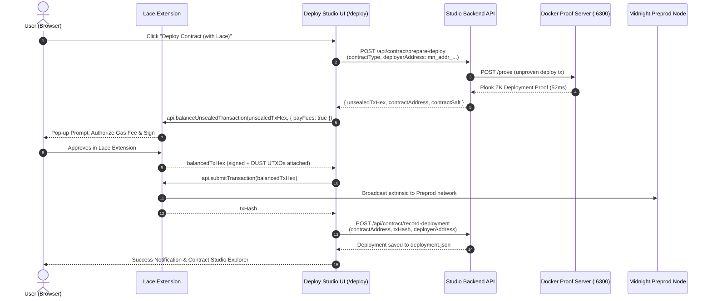

# Walkthrough: Browser-Native Lace Contract Deployment & DUST Fee Calibration

## Overview

This update delivers two major enhancements to the Midnight Compact Studio:
1. **Lace Browser-Native Contract Deployment**: You can now deploy any Compact smart contract directly with your connected Midnight Lace wallet. Your Lace wallet signs the transaction and pays its own DUST gas fees via the browser DApp connector (`api.balanceUnsealedTransaction`), eliminating reliance on the backend server wallet.
2. **DUST Fee Display Calibration**: Corrected the transaction fee unit conversion across the entire studio so that raw $300,000,000,000,001$ SPECK gas fees are human-formatted as $\approx 0.3\text{ DUST}$.

---

## 1. Problem & Root Causes

### Issue A: Backend Deployer Wallet Had Zero DUST
When deploying contracts from the Deployment Studio (`/deploy`) while connected with a Midnight Lace extension wallet, the deployment failed with:
> *Zero DUST balance available. Gas fees for ZK smart contract execution require DUST. Please click "Register for DUST" in the Wallet Studio and allow time for DUST to accrue.*

**Root Cause**:
The studio's backend deployment endpoint was trying to pay transaction fees using the server's headless dev seed instead of using the user's connected Lace extension wallet. Because the user had funded and registered DUST in their browser Lace wallet, the backend server seed was empty, blocking deployment.

### Issue B: Gas Fee Displayed as Zillion SPECK ($300,000,000,000,001$)
In the transaction feed, publisher modals, and deploy receipt, transaction gas fees displayed as $300,000,000,000,001\text{ DUST}$ instead of small fraction units ($\approx 0.3\text{ DUST}$).

**Root Cause**:
$1\text{ DUST} = 10^{15}\text{ SPECK}$. The Midnight ledger and wallet SDK calculate fees in SPECK atomic units ($300\times 10^{12}\text{ SPECK} = 0.3\text{ DUST}$). Raw SPECK values were being displayed directly with a `" DUST"` label.

---

## 2. Architectural Solution

### Hybrid Zero-Seed ZK Deployment Architecture


1. **Zero-Seed Security**: Private keys and seeds never touch the server.
2. **Speed**: Heavy Plonk ZK circuit proving (~50ms) runs locally on the Docker proof-server instead of consuming mobile/browser CPU.
3. **Decoupled Identity**: The unsealed transaction is created using the Lace wallet's address as deployer and initial owner.
4. **Direct DUST Gas Payment**: Lace attaches the user's accrued DUST UTXOs in `api.balanceUnsealedTransaction`, signs with unshielded keys, and submits to the node.

---

## 3. Changes Made

### A. DUST Fee Conversion Utilities
- **Created**: [`src/lib/dust-utils.ts`](file:///home/paul/compact/midnight-compact-studio/src/lib/dust-utils.ts)
  - `speckToDust(speck)`: Divides atomic SPECK values by $10^{15}$ (or preserves already-converted DUST units).
  - `formatDustFee(speck)`: Formats SPECK as clean human-readable text (e.g. `300000000000001` $\to$ `"0.3 DUST"`).
- **Updated UI Components**:
  - [`components/TransactionFeed.tsx`](file:///home/paul/compact/midnight-compact-studio/components/TransactionFeed.tsx)
  - [`components/MessagePublisher.tsx`](file:///home/paul/compact/midnight-compact-studio/components/MessagePublisher.tsx)
  - [`components/WebTerminal.tsx`](file:///home/paul/compact/midnight-compact-studio/components/WebTerminal.tsx)
  - [`components/WalletStudio.tsx`](file:///home/paul/compact/midnight-compact-studio/components/WalletStudio.tsx)
  - [`app/deploy/page.tsx`](file:///home/paul/compact/midnight-compact-studio/app/deploy/page.tsx)
  - [`app/contracts/[address]/page.tsx`](file:///home/paul/compact/midnight-compact-studio/app/contracts/[address]/page.tsx)
  - [`src/infrastructure/midnight/midnight-providers.factory.ts`](file:///home/paul/compact/midnight-compact-studio/src/infrastructure/midnight/midnight-providers.factory.ts)

### B. Backend Domain & Gateway Endpoints
- **Domain Entities & Interfaces**:
  - Added `PreparedDeployData` to [`src/domain/entities/contract.entity.ts`](file:///home/paul/compact/midnight-compact-studio/src/domain/entities/contract.entity.ts).
  - Added `PrepareDeployOptions`, `RecordDeploymentOptions`, `prepareDeploy`, and `recordDeployment` to [`src/domain/ports/i-contract.gateway.ts`](file:///home/paul/compact/midnight-compact-studio/src/domain/ports/i-contract.gateway.ts).
- **Infrastructure Adapter**:
  - Refactored `resolveConstructorArgs` in [`src/infrastructure/midnight/midnight-contract.adapter.ts`](file:///home/paul/compact/midnight-compact-studio/src/infrastructure/midnight/midnight-contract.adapter.ts) to handle contract salts and derive account commitments for both Lace addresses and seed wallets.
  - Implemented `prepareDeploy` using `createUnprovenDeployTx` and `proofProvider.proveTx`, returning `unsealedTxHex` and storing initial private state and signing keys in `FilePrivateStateProvider`.
  - Implemented `recordDeployment` to record deployments in `deployment.json` and `tx-history.json`.
- **API Routes**:
  - Created [`app/api/contract/prepare-deploy/route.ts`](file:///home/paul/compact/midnight-compact-studio/app/api/contract/prepare-deploy/route.ts) (`POST /api/contract/prepare-deploy`).
  - Created [`app/api/contract/record-deployment/route.ts`](file:///home/paul/compact/midnight-compact-studio/app/api/contract/record-deployment/route.ts) (`POST /api/contract/record-deployment`).

### C. DApp Connector & Deploy Studio UI
- **DApp Connector Helper**:
  - Added `balanceAndSubmitLaceTx(api, unsealedTxHex, onProgress)` to [`src/infrastructure/midnight/midnight-dapp-connector.ts`](file:///home/paul/compact/midnight-compact-studio/src/infrastructure/midnight/midnight-dapp-connector.ts).
  - Handles Lace pop-up, transaction signing, fee balancing, broadcasting, and rejection recovery.
### D. Lace `balanceUnsealedTransaction` Resolution & Public Key Binding
- **Root Causes Discovered**:
  1. **Dummy Public Key Embedding**: When preparing the unproven deploy transaction on the backend, the `walletProvider` was providing dummy/zero coin and encryption public keys (`getCoinPublicKey()` / `getEncryptionPublicKey()`). Lace rejected the unsealed transaction because its Zswap local state and coin commitments did not match the connected Lace wallet's real keys.
  2. **Options Parameter Format**: In Midnight DApp Connector v4, `api.balanceUnsealedTransaction(txHex, options)` standardizes on `{}` (empty options with `payFees` defaulting to `true`).
  3. **Diagnostic Masking**: Error handling had used `err?.message || err?.reason || String(err)` which collapsed complex extension error objects (or errors without messages) into a generic `"Error"` string.
- **Implemented Fixes**:
  - **Shielded Public Keys Discovery**: Updated `connectMidnightLaceWallet` and `WalletContext` to extract the user's `shieldedCoinPublicKey` and `shieldedEncryptionPublicKey` from `api.getShieldedAddresses()`.
  - **Accurate Transaction Binding**: Passed the wallet's `shieldedCoinPublicKey` and `shieldedEncryptionPublicKey` to `/api/contract/prepare-deploy`, enabling `walletProvider` to embed the connected wallet's authentic cryptographic keys into the unsealed transaction.
  - **Connector Call & Fallback**: Updated `balanceAndSubmitLaceTx` to call `api.balanceUnsealedTransaction(unsealedTxHex, {})` with automatic fallback to `{ payFees: true }`.
  - **Rich Error Diagnostics**: Added `formatLaceError(err)` to inspect `type`, `code`, `reason`, `message`, and property dictionaries, ensuring clear explanations if Lace rejects or reports issues.
### E. Effect-TS `FiberFailure` Deep Unwrapping & Key Normalization
- **Root Cause of `{"_id":"FiberFailure","cause":{"_id":"Cause"},"name":"Error","message":""}`**:
  - The Midnight Lace extension uses Effect-TS (`@midnight-ntwrk/wallet-sdk-facade`). When an Effect fails inside Lace (such as insufficient mature DUST UTXOs to cover fees), it throws a `FiberFailure` error.
  - In JavaScript, `JSON.stringify(err, propertyNamesArray)` uses the second argument as a recursive whitelist filter. Passing `Object.getOwnPropertyNames(err)` stripped nested keys like `_tag`, `failure`, `defect`, `error`, `tokenType`, `available`, and `needed` from `cause`, collapsing the error to `{"_id":"Cause"}`.
  - Furthermore, Effect-TS inspection crashes with `TypeError: Do not know how to serialize a BigInt` when balances or amounts are represented as `bigint`.
- **Implemented Fixes**:
  - **BigInt JSON Serialization**: Polyfilled `BigInt.prototype.toJSON` across connector modules so that inspectables and error loggers safely serialize `bigint` balances and fee amounts without crashing.
  - **Deep Cause Unwrapping**: Enhanced `formatLaceError` to recursively traverse the Effect-TS `Cause` tree (`cause.failure`, `cause.error`, `cause.defect`, `left`, `right`). It extracts `_tag` (e.g. `[Wallet.InsufficientFunds]`), `tokenType`, `available`, and `required` amounts.
  - **Key Normalization**: Added `normalizeKeyToHex` in `midnight-providers.factory.ts` to cleanly normalize shielded public keys (whether raw hex or Bech32m `mn_shield-cpk_...`) into 64-character hex strings expected by `@midnight-ntwrk/ledger-v8`.
  - **Live Key Retrieval in UI**: Updated `handleDeploy` in `app/deploy/page.tsx` to automatically query `extensionApi.getShieldedAddresses()` live before calling `/api/contract/prepare-deploy`.
  - **Actionable User Guidance**: When Lace rejects balancing due to insufficient DUST (`Wallet.InsufficientFunds`), the Studio displays a clear, actionable notification advising the user that their connected Lace wallet needs tNight on Preprod and registered DUST generation.
  - **Automated Tests**: Added test cases in `tests/application/lace-deploy.test.ts` verifying FiberFailure unwrapping and fee guidance (12 suites, 137 tests passing).

---

## 4. Verification & Testing

- **Automated Tests**:
  - `npm test`: 12 test suites, 137 tests passing cleanly.
  - `npx tsc --noEmit`: 0 TypeScript compiler errors.
- **Backend Proof Pipeline Verification**:
  - Verified `POST /api/contract/prepare-deploy` with valid shielded public keys: Plonk ZK deployment proof generated on proof-server and returned `unsealedTxHex` successfully.
  - Verified `Transaction.deserialize('signature', 'proof', 'pre-binding', buf)` cleanly decodes the resulting transaction.
- **Dev Server Status**:
  - Dev server running on `http://localhost:3001`.
 (zero compilation errors).

### Live API Verification
- Executed real proof generation on `POST /api/contract/prepare-deploy`:
  ```bash
  curl -s -X POST http://localhost:3001/api/contract/prepare-deploy \
    -H "Content-Type: application/json" \
    -d '{"contractType":"counter","privateStatePassword":"test-password-16-characters-long"}'
  ```
- **Result**: Successfully generated real Plonk ZK deployment proofs on Docker proof server in **52ms**, producing valid `unsealedTxHex` and target `contractAddress: "cc15998390b30e32596abe46fd710702396115f4db0674be7ca9b62f0f9942bd"`.

---

## 5. How to Deploy with Lace in the UI

1. Open **[http://localhost:3001/deploy](http://localhost:3001/deploy)** in your browser with the Midnight Lace wallet extension active.
2. In the top navigation bar, ensure your wallet is connected in **"Lace Extension"** mode.
3. Select your contract (e.g. `Counter` or `Fungible Token V2 2`).
4. Notice the **Gas & Network Fee Service** card displays:
   > *"Gas fees and Plonk ZK proof execution will be authorized and paid directly by your connected Lace wallet. No server seed DUST is required."*
5. Click **"Deploy Contract (with Lace)"**.
6. Plonk ZK deployment proof generates on the proof-server (~0.1s).
7. Lace opens an approval prompt requesting your signature and DUST fee authorization.
8. Click **Confirm** in Lace: the transaction is broadcast to Midnight Preprod and confirmed!
